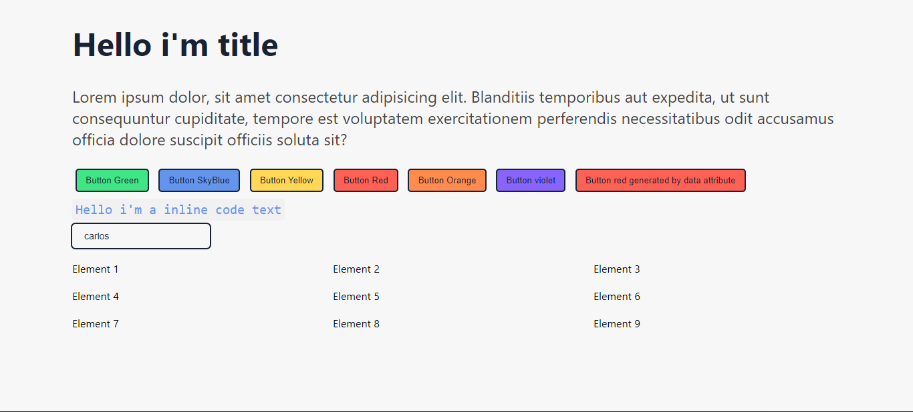

# V-Icons

Design system focused on a linear and minimalist approach using a simple and user-friendly color palette.

V-icons is a package of custom elements based on webcomponents made with [Lit](https://lit.dev 'Lit') and [Typescript](https://www.typescriptlang.org/) and used from a CDN or used from a module in some framework like Angulr or react.

## Avalible items

- [v-text](#v-text)
- [v-title](#v-title)
- [v-button](#v-button)
- [v-code-inline](#v-code-inline)
- [v-content](#v-content)
- [v-input](#v-input)
- [v-grid](#v-grid)

## v-text

> Attributes

| name | type     | example               |
| ---- | -------- | --------------------- |
| data | `string` | `data="dynamic text"` |

```html
<v-text>Text from slot</v-text>
or
<v-text data="Text from data atribute"></v-text>
```

## v-title

> Attributes

| name | type     | example               |
| ---- | -------- | --------------------- |
| data | `string` | `data="dynamic text"` |

```html
<v-title>Title from slot</v-title>
or
<v-title data="Title from data atribute"></v-title>
```

## v-button

> Attributes

| name  | type                                            | example               |
| ----- | ----------------------------------------------- | --------------------- |
| color | `blue` `red` `orange` `violet` `green` `yellow` | `color="blue"`        |
| data  | `string`                                        | `data="dynamic text"` |

> Example

```html
<v-button color="blue">Blue button</v-button>
<v-button color="green">Green button</v-button>
<v-button color="red">Red button</v-button>
<v-button color="yellow">Yellow button</v-button>
<v-button color="orange">Orange button</v-button>
<v-button color="violet">Violet button</v-button>
or
<v-button color="blue" data="Blue button"></v-button>
```

## v-code-inline

> Attributes

| name | type     | example               |
| ---- | -------- | --------------------- |
| data | `string` | `data="dynamic text"` |

```html
<v-code-inline>Code text from slot</v-code-inline>
or
<v-code-inline data="Code text from data atribute"></v-code-inline>
```

## v-content

> Attributes

| name | type   | example |
| ---- | ------ | ------- |
| none | `none` | `none`  |

```html
<v-content>
  <h1>Text in container</h1>
</v-content>
```

## v-input

> Attributes

| name        | type     | example               |
| ----------- | -------- | --------------------- |
| placeholder | `string` | `placeholder="hello"` |
| debounce    | `number` | `debounce="200"`      |

> Events

| name   | return   |
| ------ | -------- |
| output | `string` |

```html
<v-input placeholder="Write some text" debounce="200"></v-grid>
or
<v-input  />
```

## v-grid (in development)

> Attributes

| name | type     | example    |
| ---- | -------- | ---------- |
| rows | `number` | `rows="3"` |
| cols | `number` | `cols="2"` |
| gap  | `number` | `gap="20"` |

```html
<v-grid rows="3" cols="2" gap="20">
  <v-item></v-item>
  <v-item></v-item>
  <v-item></v-item>
  <v-item></v-item>
  <v-item></v-item>
  <v-item></v-item>
</v-grid>
```
